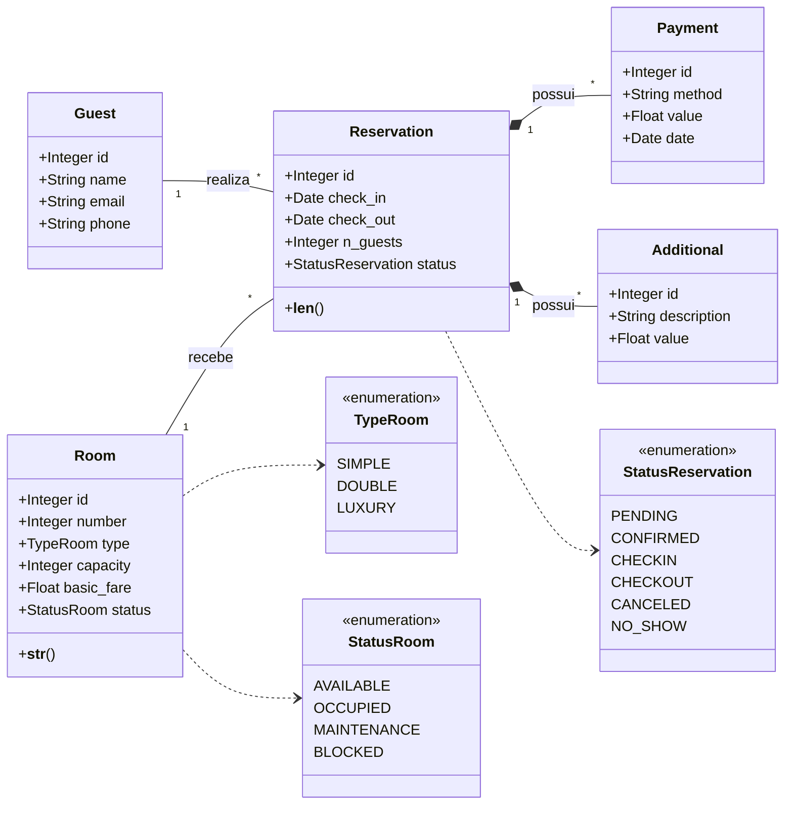

# SISTEMA DE RESERVAS DE HOTEL (v1.0)

Este repositório contém a entrega final do Projeto 1 da disciplina de Programação Orientada a Objetos (Engenharia de Software - UFCA). O sistema é uma API REST desenvolvida com **FastAPI** para gerenciar reservas de hotel, incluindo cálculo de tarifas dinâmicas, controle de estoque de quartos e relatórios gerenciais.

## Funcionalidades Principais (v1.0)

* **CRUD de Quartos e Hóspedes**: Cadastro completo com validações.
* **Ciclo de Reserva**: Criação -\> Confirmação -\> Check-in -\> Check-out.
* **Políticas de Negócio**:
  * Impedimento de Overbooking.
  * Validação de capacidade do quarto.
  * Bloqueio de quartos em manutenção.
* **Financeiro**:
  * Tarifas dinâmicas (Fim de Semana +20%, Alta Temporada +50%).
  * Lançamento de itens adicionais (frigobar, serviços).
  * Cálculo automático no Check-out.
* **Relatórios Gerenciais**: Endpoint dedicado para métricas de hotelaria (ADR, RevPAR, Ocupação).

## Tecnologias Utilizadas

* **Python 3.12+**
* **FastAPI**: Framework web moderno e rápido.
* **SQLAlchemy**: ORM para persistência de dados.
* **SQLite**: Banco de dados relacional simples.
* **Pytest**: Suíte de testes automatizados.

## Instruções de Inicialização

Instale as dependências:
```
pip install -r requirements.txt
```

Inicialize o servidor:
```
python run.py
```

Acesse a **Documentação Interativa** para testar os endpoints:
`http://127.0.0.1:8000/docs`

## Como Executar os Testes

Para validar todas as regras de negócio e garantir a qualidade da entrega, execute:
```
pytest
```

## Definição da estrutura de classes (Modelagem OO)

### Classe: Person
Classe base que representa uma pessoa no sistema.

**Atributos:**
- `name`: str
- `email`: str
- `phone`: str
- `documents`: List[Document]

**Métodos:**
- `add_document(type_doc, number)`: Adiciona um documento à lista.
- `__str__()`: Retorna o nome da pessoa.

---

### Classe: Document
Representa um documento de identificação.

**Atributos:**
- `doc_type`: TypeDocument (Enum: CPF, PASSPORT)
- `number`: str

**Métodos:**
- `__str__()`: Formata o número e tipo do documento para exibição.

---

### Classe: Guest (Herda de Person)
Representa o hóspede e seu histórico.

**Atributos:**
- `history`: List[Reservation] (Lista de reservas passadas e atuais)

**Métodos:**
- Herda todos os métodos de `Person`.

---

### Classe: Room
Representa um quarto do hotel com validação de dados de capacidade e tarifa.

**Atributos:**
- `number`: int
- `type`: TypeRoom (Enum: SIMPLE, DOUBLE, LUXURY)
- `capacity`: int (Validado via property: deve ser >= 1)
- `basic_fare`: float (Validado via property: deve ser > 0)
- `status`: StatusRoom (Enum: AVAILABLE, OCCUPIED, MAINTENANCE, BLOCKED)

**Métodos:**
- `__str__()`: Retorna detalhes formatados do quarto.
- `__lt__(other)`: Permite ordenação de quartos baseada no tipo e depois no número.

---

### Classe: Reservation
Representa o contrato de locação entre um Hospede e um Quarto.

**Atributos:**
- `guest`: Guest
- `room`: Room
- `check_in`: date
- `check_out`: date
- `n_guests`: int (Validado para não exceder a capacidade do quarto)
- `status`: StatusReservation (Enum: PENDING, CONFIRMED, etc.)
- `payments`: List[Payment]
- `additionals`: List[Additional]

**Métodos:**
- `__len__()`: Retorna o número de diárias (calculado pela diferença de datas).
- `__eq__(other)`: Verifica igualdade de reservas baseada no número do quarto e datas.
- `__str__()`: Retorna um resumo textual da reserva.

---

### Classe: Additional
Representa um item de consumo ou serviço extra.

**Atributos:**
- `description`: str
- `value`: float

---

### Classe: Payment
Representa uma transação financeira associada à reserva.

**Atributos:**
- `method`: str
- `value`: float
- `date`: date (Define automaticamente a data atual na criação)

---

### Enums

- **TypeRoom:** SIMPLE, DOUBLE, LUXURY.
- **StatusRoom:** AVAILABLE, OCCUPIED, MAINTENANCE, BLOCKED.
- **StatusReservation:** PENDING, CONFIRMED, CHECKIN, CHECKOUT, CANCELED, NO_SHOW.
- **TypeDocument:** CPF, PASSPORT.

---

## Diagrama de Classes

